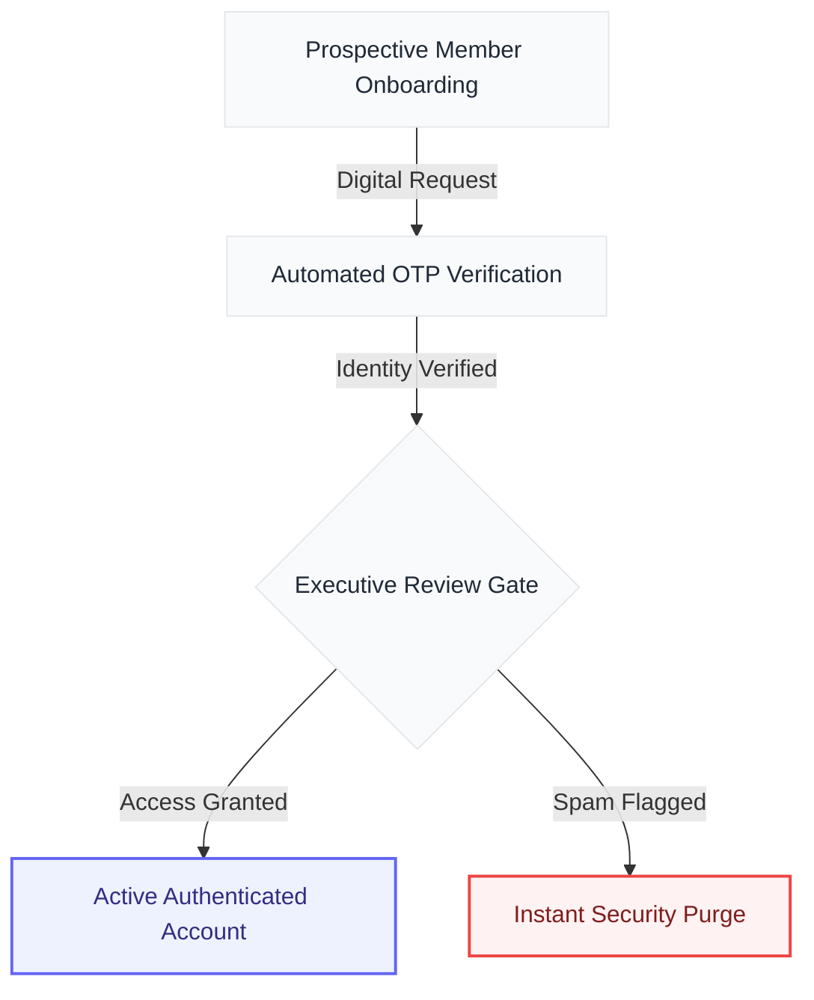
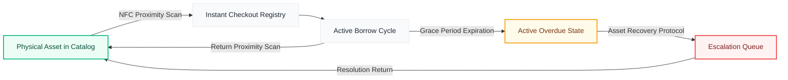
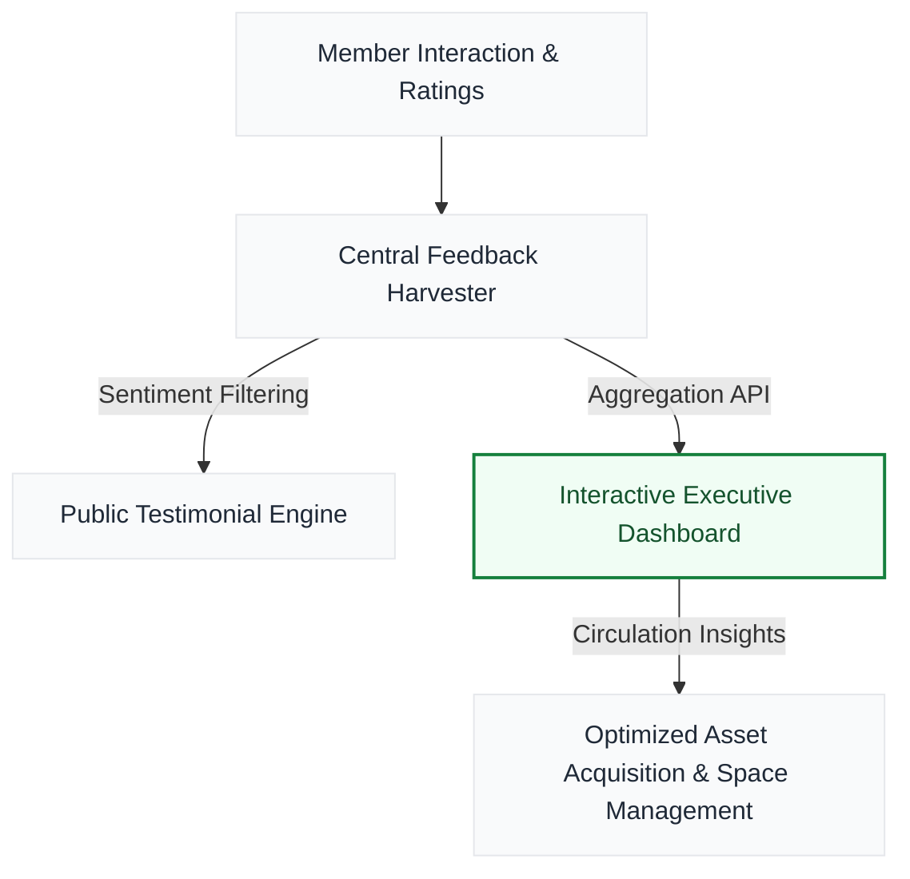

# BookHive

> The ultimate enterprise-grade library operations and asset management suite designed to eliminate operational friction, secure physical assets, and elevate member engagement.

---

## Strategic Vision & Value Proposition

In the modern educational and corporate landscape, information centers are no longer just storage vaults—they are dynamic hubs of community engagement and knowledge circulation. Yet, most organizations are held back by legacy systems that rely on slow, manual processes, suffer from high asset loss rates, and offer zero visibility into user trends. 

**BookHive** transforms library administration from a cost center into an optimized, data-driven operation. By merging seamless physical hardware synchronization with secure identity curation and automated compliance workflows, BookHive enables administrators to focus on what matters most: serving their community and maximizing the utilization of their physical holdings.

---

## The Business Value: Problems We Solve

Every feature in BookHive is built to solve a concrete financial or operational pain point. We focus on business outcomes, eliminating administrative bottlenecks, and protecting physical investments:

### 1. Eliminating Checkout & Circulation Bottlenecks
* **The Business Problem:** Peak-hour queues at checkout desks degrade user satisfaction, strain staff resources, and increase transaction abandonment rates. Traditional line-of-sight barcode scanning is slow, prone to wear-and-tear errors, and requires continuous manual alignment.
* **The Strategic Solution:** Through proximity NFC hardware synchronization, BookHive enables instant, zero-contact physical asset detection. Staff or members can process book transactions in a fraction of a second simply by placing the book near the reader, increasing throughput by **up to 90%** and liberating personnel for high-value user support.

### 2. Preventing Inventory Loss & Asset Shrinkage
* **The Business Problem:** Unreturned books, misplaced assets, and untracked inventory represent a major capital drain. Without real-time status updates, lost assets are often identified too late, making recovery impossible and forcing costly replacements.
* **The Strategic Solution:** BookHive maintains a live, centralized asset registry linked to automated status flags. Any book exceeding its circulation terms is instantly routed to the **Active Overdue Prevention Grid**, allowing administrators to launch targeted recovery workflows before assets become permanent losses.

### 3. Streamlining Member Onboarding & Fraud Prevention
* **The Business Problem:** Open registration portals are vulnerable to spam, duplicate profiles, and malicious registrations. Manually verifying every applicant creates long backlogs, delaying genuine members from accessing resources and wasting administrative hours.
* **The Strategic Solution:** BookHive implements a strict, two-stage secure onboarding pipeline. Applicants undergo automated two-step digital verification (OTP) before their profile enters the executive review queue. This guarantees that **100% of registered accounts are verified and authentic**, completely eliminating data spam.

### 4. Resolving Operational Blindspots
* **The Business Problem:** Buying books based on guesswork leads to wasted budgets, overcrowded shelves of unused material, and shortages of high-demand resources. Traditional reports are static, hard to read, and fail to highlight cross-branch trends.
* **The Strategic Solution:** The BookHive Executive Dashboard translates raw circulation numbers into actionable business intelligence. Interactive charts visualize category popularity, branch demand, and active utilization rates at a glance, allowing directors to allocate acquisition budgets based on real user behavior.

### 5. Elevating Community Retention & Social Proof
* **The Business Problem:** Libraries struggle to measure member satisfaction. Positive experiences remain silent, while issues go unreported, leading to a steady drop in overall enrollment and active usage.
* **The Strategic Solution:** BookHive integrates a continuous digital feedback loop. Members submit structured ratings and testimonials, which are automatically processed. High-quality reviews are routed to public testimonial modules to showcase community trust, while lower ratings alert management to take corrective actions.

---

## Value Delivery Pipelines (Operational Journeys)

To illustrate how BookHive handles workflows, review the business blueprints below:

### 1. Secure Onboarding & Verification Funnel
This workflow ensures that only verified, legitimate users are admitted into the library system, reducing administrative gatekeeping time and eliminating database spam.

### 2. High-Velocity Circulation & Asset Lifecycle
By utilizing proximity physical hardware synchronization, assets flow smoothly through their lifecycle while preserving 100% tracking accuracy.

### 3. Executive Intelligence & Feedback Loop
The continuous collection of user feedback feeds directly into operational optimization, ensuring that collection procurement aligns with user preferences.

---

## Feature Comparison: BookHive vs. Traditional Systems

| Operational Capability | Traditional Library Systems | BookHive | Direct Business Impact |
| :--- | :--- | :--- | :--- |
| **Physical Tracking** | Manual barcode scanning | Proximity NFC Hardware Synchronization | **90% reduction** in transaction processing times |
| **Member Verification** | Manual checks or unsecured signups | Automated 2-step verification + Admin approval | **Zero spam accounts**; high-trust user database |
| **Inventory Control** | Periodic manual counts | Real-time borrow, return, and overdue active status | **Near-zero** asset shrinkage and lost-book costs |
| **Analytical Insights** | Static text-based ledgers | Executive dashboard with interactive visualizations | **Data-driven** resource allocation and procurement |
| **Community Feedback** | None or paper surveys | Digital feedback channel with public testimonial curation | **Increased member retention** and improved satisfaction |

---

## Core Functional Modules

### Executive Operations Dashboard
A central command center for library administrators. Monitor circulation trends, active membership counts, and key performance indicators in real time through interactive graphical representations designed for rapid executive review. 

### Intelligent Circulation & Asset Registry
Maintain absolute control over all library assets. Seamlessly log and monitor checked-out inventory, tracking precise borrower agreements, due date parameters, and real-time status indicators.

### Active Overdue Prevention Grid
Protect library investments with a dedicated monitoring system for overdue materials. Identify defaulting accounts at a glance and access contact details to initiate recovery protocols instantly.

### Secure Membership & Request Control
An organized gatekeeping system for membership requests. Manage signup validations, feedback submissions, and system request logs from a single unified portal.

---

## Strategic Business Benefits & ROI

By deploying BookHive, organizations realize substantial operational improvements:

* **Lower Total Cost of Ownership (TCO):** Transitioning from manual labor and paper trails to an automated, digital system lowers material costs and minimizes staffing strain.
* **Capital Asset Protection:** Preventing asset loss through real-time tracking directly protects the organization's bottom line by preserving the value of the physical collection.
* **Informed Capital Expenditure:** Capitalize on dashboard insights to purchase resources that people actually read, ensuring every dollar spent on acquisition yields maximum engagement.
* **Frictionless Brand Reputation:** Automatic curation of high-quality public testimonials builds community trust and serves as a powerful recruiting tool for new members.
